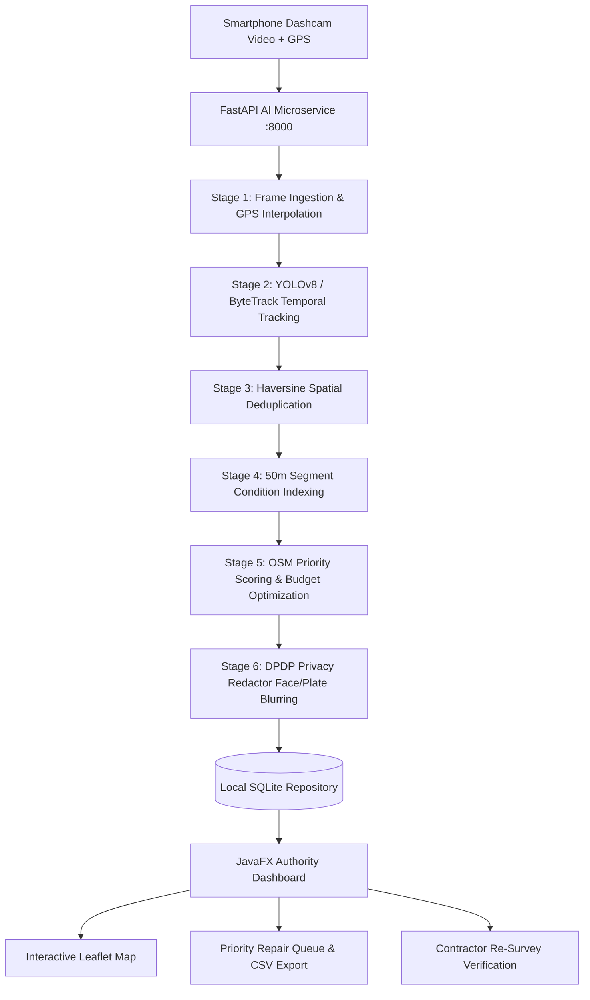

# Multi-Stage Road Damage AI & Municipal Repair Decision System

[](https://github.com/road-damage-system/actions)
[](LICENSE)
[](pyproject.toml)
[](java-app/pom.xml)
[](docs/PRIVACY.md)

An end-to-end operational intelligence system that transforms smartphone dashcam footage into an auditable, GPS-mapped, deduplicated, and budget-constrained road repair queue for Indian municipal public works departments and highway authorities.

---

## 1. System Architecture



### Core Components
1. **AI Processing Service (`ai-service/`):**
   - **Detection & Tracking:** Lightweight YOLOv8 ONNX model with ByteTrack to track defects across frames and select the optimal closest-approach observation.
   - **GPS Synchronisation & Spatial Dedup:** Interpolates vehicle trajectory (CSV/GPX) and clusters tracks within a 5.0m radius to eliminate duplicate reports for the same defect.
   - **Segment Condition Index:** Aggregates union-area damage across 50m road segments without double-counting overlapping cracks.
   - **OSM Priority Scoring:** Multiplies visual severity with road hierarchy (primary/secondary/residential) and proximity to sensitive facilities (schools, hospitals).
   - **DPDP Privacy Redactor:** Automatically detects and applies heavy Gaussian blurring to faces and vehicle registration plates before crops or frames are written to disk.
   - **Single-Writer SQLite Database:** Stores all surveys, defects, and segments with strictly parameterised queries (no ORM bloat).
2. **Desktop Authority Application (`java-app/`):**
   - Built on Java 21 and JavaFX with a bundled, offline-resilient Leaflet map viewer.
   - **Queue View:** Interactive budget slider (`₹0` to `₹10,00,000`) dynamically selecting optimal repairs matching available municipal funds with CSV export.
   - **Verification View:** Side-by-side comparative inspection between baseline survey crops and resurvey footage (Mark as Repaired / Failed / Keep Open).
   - **Demo Mode (`--demo`):** Runs 100% offline without network requests, populating all views from local fixtures.

---

## 2. Quickstart & Installation

### Prerequisites
- **Python:** Version 3.10+ (managed via `uv`)
- **Java:** JDK 21+
- **Maven:** Apache Maven 3.9+
- **Git**

### Installation Steps
```bash
# 1. Clone repository
git clone https://github.com/road-damage-system/road-damage-system.git
cd road-damage-system

# 2. Install Python dependencies and tools (Ruff, Pytest)
make setup

# 3. Verify system health & run full test suites
make check
cd java-app && mvn -B test && cd ..
```

---

## 3. Running the System

### Option A: Complete Microservice + Dashboard
```bash
# Terminal 1: Start FastAPI microservice (port 8000)
make run-ai

# Terminal 2: Launch JavaFX Authority Dashboard
cd java-app
mvn javafx:run
```

### Option B: Offline Demo Mode (Air-Gapped / Presentation Ready)
The dashboard includes an offline demo mode that requires **no running backend, no database, and zero internet connection**:
```bash
cd java-app
mvn javafx:run -Djavafx.args="--demo"
```
In demo mode:
- **Map Tab:** Displays pre-mapped Bengaluru demo defects on an offline-safe local grid canvas.
- **Queue Tab:** Loads ranked repair candidates with active budget allocation and CSV export.
- **Verify Tab:** Demonstrates contractor resurvey audit workflows.

---

## 4. API Endpoints

All endpoints except `/health` require an `X-API-Key` header (default: `dev-secret-key`):

| Method | Endpoint | Description | Auth Required |
|---|---|---|:---:|
| `GET` | `/health` | Liveness check | No |
| `POST` | `/api/v1/surveys` | Upload video + GPS track (`multipart/form-data`) | Yes |
| `GET` | `/api/v1/surveys` | List all historical surveys | Yes |
| `GET` | `/api/v1/surveys/{id}` | Survey summary with defect & segment counts | Yes |
| `GET` | `/api/v1/surveys/{id}/defects` | List unique deduplicated defects | Yes |
| `GET` | `/api/v1/surveys/{id}/segments` | List 50m road condition ratings | Yes |
| `GET` | `/api/v1/surveys/{id}/queue?budget_inr={x}` | Budget-filtered repair work order | Yes |
| `POST` | `/api/v1/surveys/{id}/verify?against={prev_id}` | Re-survey verification against baseline | Yes |
| `GET` | `/api/v1/defects/{id}/crop` | Retrieve privacy-redacted defect crop | Yes |

---

## 5. Privacy & DPDP Compliance

In compliance with India's **Digital Personal Data Protection (DPDP) Act, 2023**:
- All images persisted to disk or rendered in UI views pass through [`app/privacy.py`](file:///C:/Users/jagan/.gemini/antigravity-ide/scratch/road-damage-system/ai-service/app/privacy.py).
- Civilian facial features and vehicle registration numbers are blurred using Gaussian kernels ($\sigma = 30$).
- Media retention is strictly bounded by configuration (`privacy.retention_days = 30`), enforced via automated cleanup in [`scripts/purge_old_media.py`](file:///C:/Users/jagan/.gemini/antigravity-ide/scratch/road-damage-system/scripts/purge_old_media.py).
- Full legal framework and threat models are documented in [`docs/PRIVACY.md`](file:///C:/Users/jagan/.gemini/antigravity-ide/scratch/road-damage-system/docs/PRIVACY.md).

---

## 6. Evaluation & Methodology

Headline metrics and ground-truth validation protocols are tracked in [`reports/METRICS_REPORT.md`](file:///C:/Users/jagan/.gemini/antigravity-ide/scratch/road-damage-system/reports/METRICS_REPORT.md):
- In adherence to strict scientific honesty, field metrics with pending real-world collection are explicitly marked as **NOT MEASURED** ($N=0$).
- Evaluation scripts in `scripts/eval_*.py` emit standardized metrics when real test corridors are traversed.
